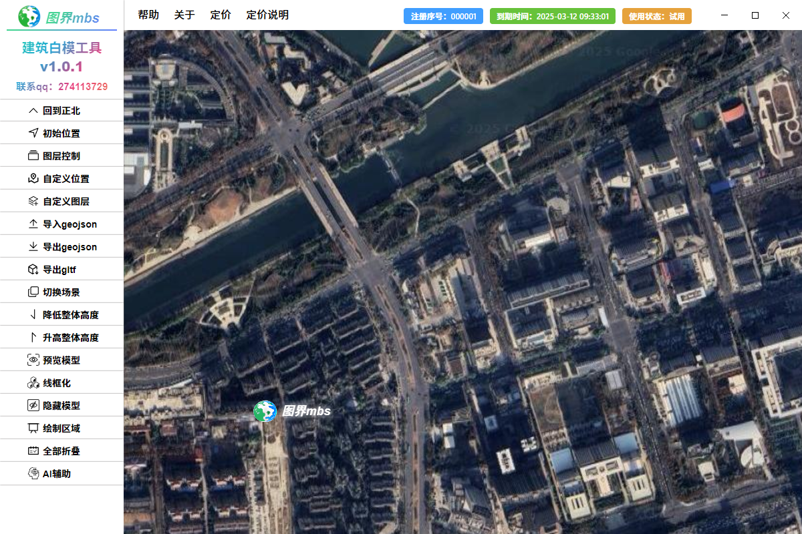

## 🌟 项目名称
> **mbs-building**  
> 是一款基于 ​Cesium​ 框架开发的轻量化工具，专注于快速生成和展示三维建筑白模（即简化建筑模型）。它适用于城市规划、建筑设计、地理信息系统（GIS）等领域，帮助用户以低成本、高效率的方式实现建筑三维可视化。

## 📋 项目简介  
**mbs-building**  
- 🚀 核心功能 

    快速生成白模

- 🌈 优势 

    交互式编辑
    提供直观的交互界面，用户可手动调整建筑高度、位置等参数。
    支持实时预览，所见即所得。
    
    ​高性能渲染
    基于 Cesium 的高性能渲染引擎，支持大规模建筑群的高效加载和流畅展示。
    支持 LOD（Level of Detail）优化，提升渲染性能。

- 🔒 应用场景

    ​城市规划：快速生成城市建筑白模，辅助规划分析和决策。

    ​建筑设计：作为初步设计阶段的参考模型，帮助设计师快速验证方案。

    ​GIS 系统：与地理信息系统结合，实现建筑数据的可视化展示。

    ​应急管理：模拟城市建筑布局，辅助灾害应急响应和演练。

---

## 🔧 功能列表  
- ✅ 功能一：图层自定义添加，位置自定义设置
- 🌐 功能二：导入导出geojson
- 📊 功能三：导出gltf 
- 🌐 功能四：绘制建筑模型区域 
- 📊 功能五：AI辅助识别
---

## 截图

---

## 📦 安装和使用  
### 环境要求  
windows系统

### 安装步骤  
点击.exe文件，一直下一步即可

